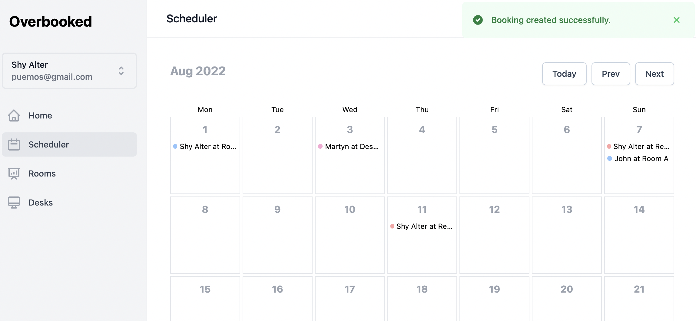

# What is Overbooked?

Overbooked is a self-hosted flexible workplace platform for indie co-working owners.

## Getting Started

**Got 2 minutes?** Check out a video overview of our product:

### Guides: Jump right in

Follow our handy guides to get started on the basics as quickly as possible:


[deploying-your-instance.md](guides/admin/deploying-your-instance.md)



[creating-your-first-resource.md](guides/admin/creating-your-first-resource.md)



[inviting-a-user.md](guides/admin/inviting-a-user.md)


### Fundamentals: Dive a little deeper

Learn the fundamentals of MyProduct to get a deeper understanding of our main features:


[rooms.md](fundamentals/rooms.md)



[users.md](fundamentals/users.md)

